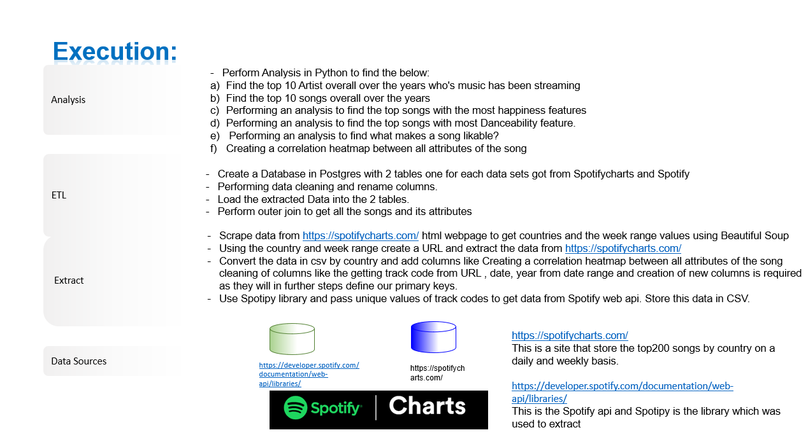

# Click-to-Insights_-ETL-SpotifyChartsAnalysis
Creating an ETL and Analyzing Spotify’s Top Tracks Using Data Visualization

#  SPOTIFY MUSIC - ETL PROJECT - SQL POSTGRES DB:

## WHAT MAKES A MUSIC LIKABLE?

#### Background:
###### As the music industry becomes more and more data driven its critical to understand the top charts and the treands to get insights on what kind of music do people like. Here we analyze the popularity aspect of songs. To understand what really makes a song likeable to the masses, I have selected a project to use Data Visualization to find patterns.
###### In this ETL ( Extract, Transform, Load), merge & visualize project, I will read top music charts dataset, analyze and visualize them using a Python.

##### Data Sources and Tools used:
######  Datasets to be used: a) https://spotifycharts.com/regional - Extracting data from this website that stores Top 200 songs for all countries by day and week. For this analysis we will be using the top 200 songs which are trending on a weekly basis.
###### b) https://developer.spotify.com/documentation/web-api/  - This is the spotify API which we will use to extract the data for the songs specifically the attributes of the song.
######  The data base where the data will be store is Postgres and we will using Python to clean, store , merge and analyze the data.

#####Goal
######Get Spotify data from diferent variaty of source such APIs, Web-scraping and Google-Scholar data-sets
######Get a Large amount of data, goal is to get around 1 Million rows.
######Once I have identified the datasets,I will perform ETL on the data and document the following within the jpynb.
######The type of transformation needed for this data (cleaning, joining, filtering, aggregating, etc).
######The type of final production database to load the data into (relational or non-relational).
######The final tables or collections that will be used in the production database.
######Submit a final technical report with the above information and steps required to reproduce your ETL process.

